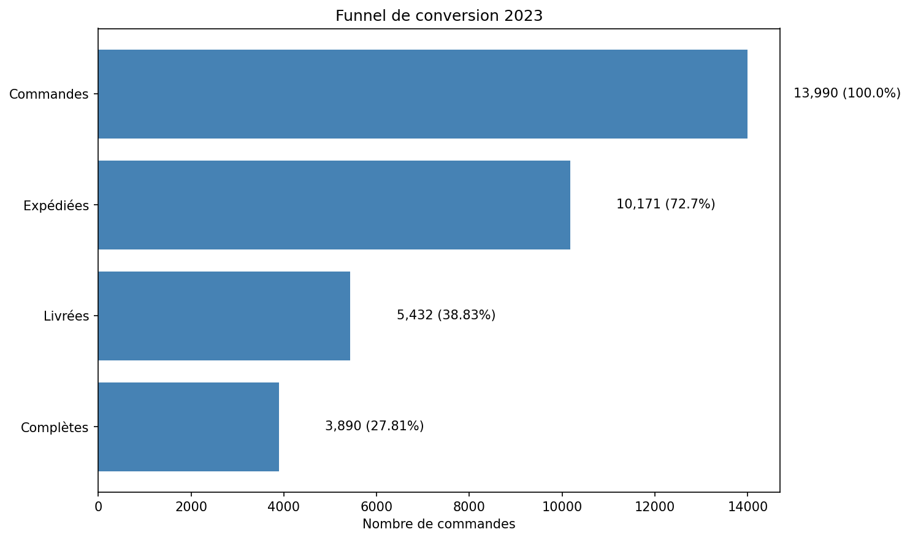

# Analyse Funnel E-commerce — TheLook 2023

## Contexte
Analyse du funnel de conversion d'un e-commerçant fictif (dataset public Google)
sur l'année 2023. Objectif : identifier les points de chute et formuler
des recommandations actionnables.

## Stack technique
- SQL (BigQuery)
- Python (Pandas, Matplotlib)

## Insights clés
1. Seulement 27% des commandes atteignent le statut "Complete"
2. La chute la plus critique : Expédiées → Livrées (-47%)
3. Sur les commandes livrées, 28% font l'objet d'un retour — un taux élevé qui mérite une analyse par catégorie produit.

## Recommandations
1. Audit du process logistique entre expédition et livraison
2. Analyse comparative N-1 pour identifier si c'est une tendance historique
3. Analyse des catégories de produit avec un fort taux de retour

## Méthodologie
Utilisation de la table 'orders' pour analyser la perte d'utilisateurs de chaque étape et calcul des métriques suivantes:
- COUNT(DISTINCT user_id) --> nombre d'acheteurs uniques (DISTINCT car un utilisateur peut faire plusieurs commandes)
- COUNT(order_id) -->  nombre de commandes
- COUNTIF(shipped_at IS NOT NULL) --> nombre de commandes en cours d'expédition (IS NOT NULL pour supprimer les lignes vides donc actuellement pas en expédition)
- COUNTIF(delivered_at IS NOT NULL) --> idem pour les commandes livréesAS commandes_livrees
- COUNTIF(status = 'Complete') --> nombre de commandes complètes
  
## Visualisation

